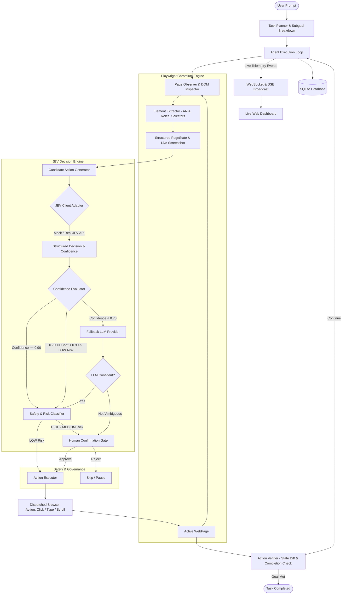

# JEV Browser Agent — Autonomous Web Task Executor

> **Confidence-aware autonomous browser agent powered by JEV System-One bounded decision capability with LLM fallback and human safety layer.**

[](https://github.com/OWNER/jev-browser-agent/actions/workflows/tests.yml)
[](LICENSE)
[](https://www.python.org/)
[](https://playwright.dev/)
[](https://fastapi.tiangolo.com)

---

## 📑 Table of Contents

- [Overview](#overview)
- [Architecture](#architecture)
- [Key Features](#key-features)
- [Screenshots & Dashboard Tour](#screenshots--dashboard-tour)
- [Confidence Routing Matrix](#confidence-routing-matrix)
- [Safety & Risk Model](#safety--risk-model)
- [Quick Start Guide](#quick-start-guide)
  - [1. GitHub Codespaces (1-Click Run)](#1-github-codespaces-1-click-run)
  - [2. Local Windows / macOS / Linux Setup](#2-local-windows--macos--linux-setup)
  - [3. Docker & Docker Compose](#3-docker--docker-compose)
- [Configuration & Modes](#configuration--modes)
  - [Mock JEV Mode](#mock-jev-mode)
  - [Real JEV API Setup](#real-jev-api-setup)
  - [Fallback LLM Setup](#fallback-llm-setup)
- [Example Tasks](#example-tasks)
- [API Reference](#api-reference)
- [Automated Testing](#automated-testing)
- [Project Limitations & Future Work](#project-limitations--future-work)
- [License](#license)

---

## 🌟 Overview

The **JEV Browser Agent** bridges fast bounded decision intelligence with real-world browser execution. Given a high-level natural language prompt (e.g., *"Open a shopping website, search for laptops under ₹50,000, and open the cheapest result"*), the agent inspects the live DOM, generates candidate actions, and employs a dedicated **JEV System-One Decision Engine** to evaluate bounded choices.

Decisions are continuously routed through a **confidence and safety matrix**:
- Decisions with confidence $\ge 0.90$ execute autonomously.
- Moderate confidence decisions ($0.70 \le \text{confidence} < 0.90$) execute only if classified as **LOW risk**; otherwise they pause for human approval.
- Low confidence decisions ($< 0.70$) escalate to a **Fallback LLM** (OpenAI-compatible / Gemini).
- **HIGH-risk actions** (payments, purchases, credential changes, data deletion) are **strictly gated** and **NEVER execute automatically**.

---

## 🏗️ Architecture



---

## 🚀 Key Features

1. **JEV System-One Bounded Decisions:** Dedicated abstraction supporting `CHOICE` (pick best action), `SCORE` (rank candidates), and `NOUL` (binary gate).
2. **Confidence-Aware Routing:** Configurable thresholding ensuring that uncertain choices are never executed blindly.
3. **Multi-Tier Fallback Architecture:** Supports mock evaluation, live JEV API, and multi-vendor fallback LLMs (OpenAI-compatible, Gemini).
4. **Resilient Browser Automation:** Playwright Chromium with multi-tier element resolution (ARIA roles, accessible names, stable CSS selectors, and coordinate fallback).
5. **Zero-Trust Safety System:** Automatic risk classification (`LOW`, `MEDIUM`, `HIGH`). High-risk actions (purchases, payments, passwords) are permanently locked behind human approval.
6. **Live Web Dashboard:** Real-time glassmorphic interface with live browser viewport streaming, decision confidence bars, candidate scores, action timelines, and approval gates.
7. **Complete Observability:** SQLite audit logs for tasks, observations, candidate actions, decision latencies, action results, and human approvals with automated credential sanitization.
8. **Devcontainer & Codespaces Ready:** Instant 1-click startup without installing local dependencies.

---

## 📸 Screenshots & Dashboard Tour

```text
+-----------------------------------------------------------------------------------------------+
| [O] JEV Browser Agent       [ MOCK JEV MODE ]   [ Auto >= 0.90 | Low >= 0.70 ]   [ Live Connected ] |
+-----------------------------------------------------------------------------------------------+
|  SECTION A: TASK INPUT                   |  SECTION B: LIVE BROWSER STATUS                    |
|  Describe what you want to do:           |  [LOCK] https://www.wikipedia.org (Wikipedia)      |
|  [ Open Wikipedia and search for AI... ] |  +-----------------------------------------------+ |
|  [START TASK] [PAUSE] [RESUME] [STOP]    |  |               [LIVE VIEWPORT]                 | |
|                                          |  |      WIKIPEDIA - Free Encyclopedia            | |
|  SECTION C: DECISION PANEL               |  +-----------------------------------------------+ |
|  Provider: JEV | Selected: TYPE element_2|  Subgoal: Enter 'artificial intelligence' query    |
|  Confidence: [█████████████████] 96.3%   |                                                    |
|  1. Type 'AI' into search - 96.3%        |  SECTION D: ACTION LOG & VERIFICATION TIMELINE     |
|  2. Click 'Search' button - 2.4%         |  10:22:01 [OBSERVE] Detected 18 elements           |
|                                          |  10:22:02 [JEV] Selected element_2 (TYPE)          |
|  SECTION F: PERFORMANCE                  |  10:22:02 [CONFIDENCE] 96.3% (Auto Approved)       |
|  Steps: 3 | JEV: 3 | Avg Conf: 95.8%     |  10:22:03 [ACTION] Typed query into search input   |
|  Success: 3 | Failed: 0 | Latency: 42ms  |  10:22:04 [VERIFY] Page loaded results article     |
+-----------------------------------------------------------------------------------------------+
```

---

## 🎯 Confidence Routing Matrix

| Condition | Risk Level | Action Taken | Rationale |
| :--- | :---: | :---: | :--- |
| **$\text{Confidence} \ge 0.90$** | `LOW` / `MEDIUM` | **Auto-Execute** | System-One is highly certain and risk is bounded. |
| **$0.70 \le \text{Confidence} < 0.90$** | `LOW` | **Auto-Execute** | Acceptable certainty for read-only / benign actions. |
| **$0.70 \le \text{Confidence} < 0.90$** | `MEDIUM` | **Human Confirmation** | Moderate confidence requires user oversight for side effects. |
| **$\text{Confidence} < 0.70$** | Any | **Escalate to Fallback LLM** | Decision escalated for reasoning and analysis. |
| **Fallback LLM Uncertain** | Any | **Human Confirmation** | Both JEV and LLM are uncertain. |
| **Any Confidence** | `HIGH` | **NEVER Auto-Execute** | Payments, deletions, and credential modifications always require human approval. |

Thresholds are configurable in both `.env` and `config.yaml`.

---

## 🛡️ Safety & Risk Model

The safety subsystem (`backend/safety/`) inspects all candidate actions before execution:
- **`LOW` Risk:** Navigating to URLs, scrolling, reading content, entering search queries, clicking navigation links.
- **`MEDIUM` Risk:** Submitting contact forms, sending messages, uploading documents, updating non-critical preferences.
- **`HIGH` Risk:** Checkout, purchase buttons, credit card / bank inputs, passwords, account deletion, API keys.

### Credential & Privacy Sanitization
All logged prompts, observations, and telemetry strings are filtered through `RiskClassifier.sanitize()` to ensure passwords, session tokens, API keys, and credit card numbers are never saved to SQLite or broadcast over WebSockets.

---

## ⚡ Quick Start Guide

### 1. GitHub Codespaces (1-Click Run)

You can launch and use JEV Browser Agent directly in your browser with zero local installation:

1. Open this repository on GitHub.
2. Click the green **Code** button at the top right.
3. Select the **Codespaces** tab.
4. Click **Create codespace on main**.
5. Wait for the devcontainer to build (it automatically installs Python, requirements, Playwright, and Chromium).
6. In the Codespace terminal, run:
   ```bash
   python run.py
   ```
7. A notification will appear: **"Your application running on port 8000 is available"**. Click **Open in Browser**.
8. Select any example task and click **START TASK**!

---

### 2. Local Windows / macOS / Linux Setup

#### Prerequisites
- Python 3.11, 3.12, or 3.13
- Git

#### Installation Steps

```bash
# 1. Clone repository
git clone https://github.com/OWNER/jev-browser-agent.git
cd jev-browser-agent

# 2. Create virtual environment
python -m venv .venv

# 3. Activate virtual environment
# Windows (PowerShell):
.\.venv\Scripts\Activate.ps1
# Linux / macOS:
source .venv/bin/activate

# 4. Install dependencies
pip install --upgrade pip
pip install -r requirements.txt

# 5. Install Playwright Chromium browser
playwright install chromium

# 6. Copy environment configuration
cp .env.example .env

# 7. Start the application
python run.py
```

Open your browser at **`http://localhost:8000`**.

---

### 3. Docker & Docker Compose

Run the entire application in a container with pre-installed Chromium dependencies:

```bash
# Using Docker Compose
docker compose up --build

# Or using plain Docker
docker build -t jev-browser-agent .
docker run -p 8000:8000 jev-browser-agent
```

Access the dashboard at `http://localhost:8000`.

---

## ⚙️ Configuration & Modes

### Mock JEV Mode (Default)
Runs immediately without any API keys or external services:
```env
JEV_MODE=mock
LLM_PROVIDER=mock
```
Mock decisions use deterministic semantic scoring and realistic confidence distributions.

### Real JEV API Setup
To connect to the live JEV System-One Decision API:
```env
JEV_MODE=real
JEV_API_KEY=your_jev_api_key_here
JEV_API_URL=https://api.jev.ai/v1
JEV_MODEL=system-one-v1
```

### Fallback LLM Setup
Configure an OpenAI-compatible or Google Gemini provider when JEV escalates:
```env
# For OpenAI / Groq / Ollama / Local LLM
LLM_PROVIDER=openai-compatible
LLM_API_KEY=your_openai_api_key_here
LLM_BASE_URL=https://api.openai.com/v1
LLM_MODEL=gpt-4o-mini

# Or for Google Gemini
# LLM_PROVIDER=gemini
# LLM_API_KEY=your_gemini_api_key_here
# LLM_MODEL=gemini-1.5-flash
```

---

## 📋 Example Tasks

Use the quick-fill chips in the UI to evaluate standard workflows:

1. **Wikipedia AI:**
   `Open Wikipedia and search for artificial intelligence.`
2. **Playwright Search:**
   `Open a search engine and search for Python Playwright.`
3. **Contact Page Discovery:**
   `Open a website and find the contact page.`
4. **FastAPI Documentation:**
   `Find the official documentation page for FastAPI.`
5. **Shopping with Price Guardrail:**
   `Search a shopping website for laptops under ₹50000 and open a matching product.`

*Note: The agent strictly enforces human approval before any checkout or transaction.*

---

## 📡 API Reference

Interactive OpenAPI documentation is available at `http://localhost:8000/docs`.

| Method | Endpoint | Description |
| :--- | :--- | :--- |
| `GET` | `/api/health` | Service health status, version, and active tasks count |
| `GET` | `/api/config` | Public configuration and confidence thresholds (keys masked) |
| `POST` | `/api/tasks` | Create and start a new autonomous task |
| `GET` | `/api/tasks/{task_id}` | Retrieve task state, metrics, steps, and decisions |
| `POST` | `/api/tasks/{task_id}/pause` | Pause task execution loop |
| `POST` | `/api/tasks/{task_id}/resume` | Resume paused task execution loop |
| `POST` | `/api/tasks/{task_id}/stop` | Stop task execution permanently |
| `POST` | `/api/tasks/{task_id}/approve`| Submit human approval for pending risky action |
| `POST` | `/api/tasks/{task_id}/reject` | Submit human rejection for pending action |
| `GET` | `/api/tasks/{task_id}/events` | Server-Sent Events (SSE) real-time event stream |
| `WS` | `/ws` or `/ws/{task_id}` | Bi-directional WebSocket stream for live UI updates |

---

## 🧪 Automated Testing

The project includes an end-to-end test suite covering candidate generation, confidence routing, JEV mock/real error handling, safety permissions, approval timeouts, and real Chromium Playwright execution against a local test page:

```bash
# Run all tests
pytest -v

# Run safety and decision tests
pytest -v tests/test_safety.py tests/test_decision_engine.py

# Run Playwright integration tests
pytest -v tests/test_agent.py
```

---

## 🔭 Project Limitations & Future Work

- **CAPTCHA Resolution:** Does not automatically bypass third-party CAPTCHAs (intentionally requests human assistance).
- **Multi-Tab Orchestration:** Currently executes within a focused browser context; future releases can add concurrent multi-tab comparison.
- **Vision Foundation Model Scoring:** Future extensions can feed DOM bounding box crops directly to multimodal vision encoders for zero-shot layout scoring.

---

## 📄 License

This project is licensed under the [MIT License](LICENSE).
